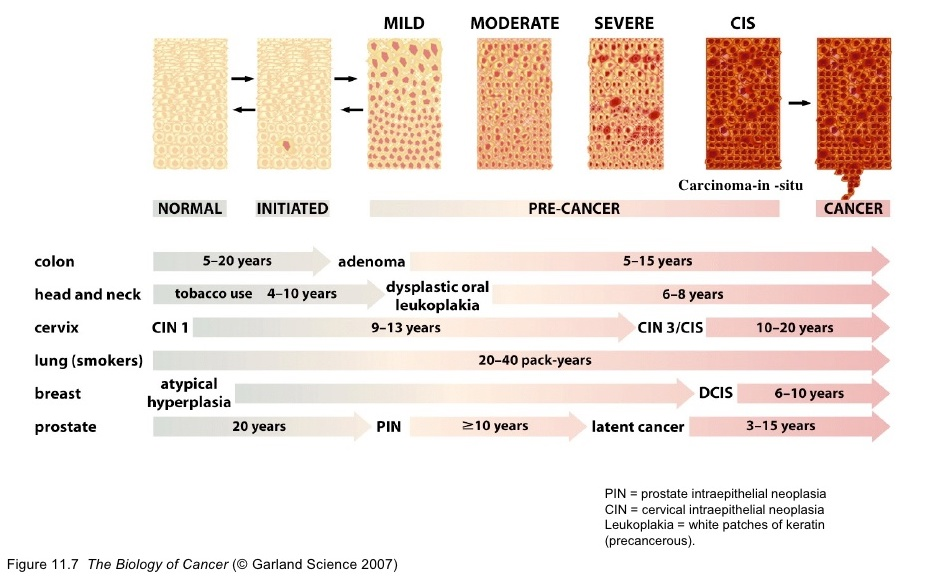
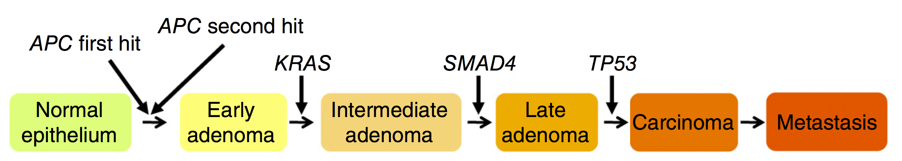
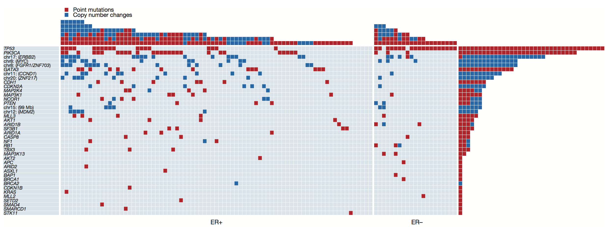
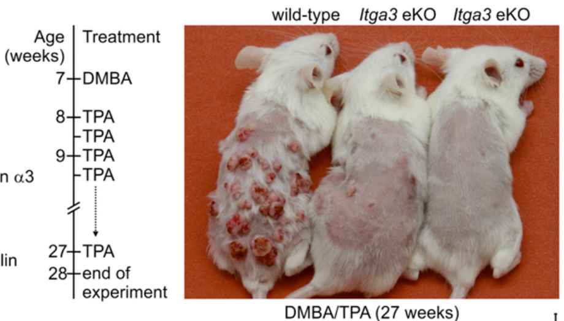

```{r setup, include=FALSE}
library(knitr)
opts_chunk$set(echo=F,message=F,dev='svg',fig.align='center')
options(htmltools.dir.version = FALSE)
library(readr)
library(tidyverse)
library(stringr)
library(reshape2)
library(plotly)
library(ggplot2)
library(ggthemes)
```

class: inverse, center, middle

# Sissejuhatuseks

---

## Rinnavähk

- Rinnavähk on üks enamlevinumatest vähitüüpidest
- 1.3 miljonit uut juhtu ja 450000 surma aastas maailmas
- Kliiniliselt heterogeenne haigus, jaotatakse kolme terapeutilisse gruppi:
    - Kõige levinum, **östrogeeni retseptor (ER)-positiivne** 
    - HER2 (ERBB2) amplifikatsioon 
    - Kolmik-negatiivne (puudub ER-i, progesterooni retseptori (PR) ja HER2 ekspressioon)

???

- Ravimiteks võib olla kas hormoonravimid, kemoteraapia või bioloogiline ravi. Tavaliselt peale operatsiooni, et minimeerida vähi tagasi tulemise võimalust
- Kemoteraapia või hormoonravi võib toimuda ka enne operatsiooni, kui on suur kasvaja, et kasvaja muutuks väiksemaks ja oleks võimalik vältida terve rinna eemaldamist

---

## Rinnakasvajad Eestis

```{r rinnavahi-stats, fig.height=4.5}
PK10 <- read_csv("data/PK10.csv") %>% 
  gather(Vanusegrupp, Esmasjuhud, 3:20)
PK10 <- mutate_at(PK10, "Vanusegrupp", str_replace, pattern = "85 ja vanemad", replacement = "85+")
PK10$Vanusegrupp <- factor(PK10$Vanusegrupp, 
                           levels = c("0-4","5-9","10-14","15-19","20-24","25-29","30-34",
                                      "35-39","40-44","45-49","50-54","55-59","60-64","65-69",
                                      "70-74","75-79","80-84","85+"))
aastad <- paste(range(PK10$Aasta), collapse = " kuni ")
PK10 %>% 
  group_by(Vanusegrupp) %>% 
  summarise(Esmasjuhud = sum(Esmasjuhud)) %>% 
  ggplot(aes(Vanusegrupp, Esmasjuhud, group=1)) +
  geom_line(colour="#F660AB", size=2) +
  geom_text(aes(label=Vanusegrupp)) +
  ggtitle(paste("Esmasjuhtumeid kokku vanusegruppides, ajavahemikus", aastad))
```

.footnote[Andmed: [Tervise Arengu Instituut](http://pxweb.tai.ee/PXWeb2015/index.html)]

???

```{r}
rv_eestis_kokku <- PK10 %>% group_by(Aasta) %>% summarise(Esmasjuhud = sum(Esmasjuhud))
```

- Kokku Eestis selle perioodi jooksul `r sum(rv_eestis_kokku$Esmasjuhud)` juhtu, kergelt tõusvas trendis, aastatel 2012 kuni 2014 keskmiselt `r filter(rv_eestis_kokku, Aasta%in%2012:2014) %>% .$Esmasjuhud %>% mean` uut juhtu aastas

---

## Rinnavähi ravi efektiivsus Eestis

```{r concord, fig.height=4, fig.width=6}
con2 <- read_csv("data/concord2.csv")
# filter(con2, Region=="Europe") %$% Country %>% unique() 
naabrid <- c("Latvia","Sweden","Estonia","Lithuania","Finland","Russia (Arkhangelsk)")
conbr <- con2 %>% 
  select(Region, Country, Period, Breast) %>% 
  filter(complete.cases(.), Region=="Europe") %>% 
  mutate(Eesti = ifelse(Country%in%naabrid, 1, 0.5))
textlabs <- filter(conbr, Country%in%naabrid, Period=="2005-09") %>% 
  select(Country, Period, Breast, Eesti)
ggplot(conbr, aes(Period, Breast, group = Country, colour = factor(Eesti), size = Eesti)) +
  geom_line() +
  geom_text(data=textlabs, aes(Period, Breast, label=Country), color="black", size=3) +
  scale_color_tableau() +
  guides(size=FALSE, colour=FALSE) +
  # theme(legend.title = element_blank()) +
  # scale_color_tableau(breaks = c(1,0), labels = c("Eesti", "Teised Euroopa\nriigid")) +
  # ylim(c(0,100)) +
  scale_x_discrete(expand = c(0.1, 0.1)) +
  scale_size_continuous(range = c(0.5,2)) +
  ggtitle("Ülemaailme vähi elulemuse uuring 1995-2009 (CONCORD-2)", 
          "Rinnavähk. Euroopa riigid, Eesti ja lähinaabrid on märgitud oranzhiga.") +
  ylab("5-aasta standardiseeritud elulemus (%)") +
  xlab("Periood")
```

.footnote[Global surveillance of cancer survival 1995–2009: analysis of individual data for 25 676 887 patients from 279 population-based registries in 67 countries [CONCORD-2](http://bit.ly/1vMo788)]

---

class: inverse, center, middle

# Mitmeastmeline vähiteke

---

## Vähiteke on pikajaline protsess

- Sporaadiline vähk on vana ea haigus 
- Pahaloomulise vähi teke võtab ilmselt aega kümneid aastaid
- 70 a. mehel on 1000 korda kõrgem risk surra käärsoole vähki kui 10 a. poisil (USA andmed)


```{r uk, include=F, fig.height=3}
uk <- read_csv("data/UKage.csv") %>% 
  gather(key, value, 2:5) %>% 
  separate(key, c("Sugu", "Arvestus")) %>% 
  mutate(Sugu = ifelse(Sugu=="Meeste", "Mehed", "Naised")) %>% 
  filter(Arvestus=="intsidents")

ggplot(uk, aes(Vanusegrupp, value, fill=Sugu)) + 
  geom_bar(stat = "identity", position="dodge") + 
  scale_fill_tableau() +
theme(axis.text.x=element_text(angle=90,color="black")) + 
  ylab("Intsidents 100000 inimese kohta") +
  ggtitle("Uued vähijuhtumid. UK, 2009-2011", subtitle = "Kõik vähid (C00-C97 välja arvatud C44)")  
```


```{r seer, fig.height=3, fig.width=4}
seer <- read.csv("data/SEER.csv")
seer %>% melt(id="Vanusegrupp", value.name="intsidents", variable.name = "Sugu") %>%
  ggplot(aes(Vanusegrupp, intsidents, fill=Sugu)) + 
  geom_bar(stat="identity", position="dodge") + 
  scale_fill_tableau() +
  scale_x_discrete(limits = rev(levels(seer$Vanusegrupp))) +
  ggtitle("Vanus-korrigeeritud vähi intsidents\nUSA 2007-2011") + 
  theme(legend.title = element_blank(),
        axis.title.x = element_blank()) +
  ylab("Intsidents 100000 inimese kohta")
```


.footnote[Andmed: [SEER Cancer Statistics Review 1975-2011](http://seer.cancer.gov/csr/1975_2011/browse_csr.php?sectionSEL=2&pageSEL=sect_02_table.07.html#table1)]


???

- USA-s läbi viidud epidemioloogilised uuringud näitavad, et 70 a. vanusel mehel on 1000-korda suurem risk surra soolevähi tagajärjel, kui 10 a. poisil
- Ainuüksi see fakt viitab, et surmava vähi tekkeks kulub aastaid, kui mitte aastakümneid
- Vähi kui haiguse hiline ilmnemine inimese elus omab ka rahvatervise seisukohalt olulist (depressiivset) tähendust -- kõikide vähkide ravimine omab ainult väikest mõju keskmisele elueale
- Läänemaailmas moodustavad vähisurmad umbes 20% kõigist surmadest
- 1990 a. Hollandis läbi viidud uuringu põhjal leiti, et kui ravida terveks kõik vähihaiged, siis selle tagajärjel pikeneks üldine eluiga meestel 3.8 aastat ja naistel 3.4 aastat (naised elavad üldiselt kauem)
- Suurima efekti annab kesmisele elueale laste ja noorte varase suremuse vähendamine

---

## Vähitekke pikaajalisus: suitsetamise mõju kopsuvähi levikule USA-s

.pull-left[

]

.pull-right[
- Kuni Teise maailmasõjani oli suitsetamine USA meeste seas vähelevinud
- 30-35 aastat hiljem, 1970-ndate aastate paiku, hakkas kopsuvähi intsidents järsult tõusma
- Praegu on ülemaailmne kopsuvähi suremus ~1.39 miljonit aastas, tipp peaks saabuma 2020-30-ndtate aastate paiku

.footnote[
Pilt: [Tobacco and the global lung cancer epidemic](http://www.nature.com/nrc/journal/v1/n1/full/nrc1001-082a.html)
]
]

???

- Matemaatiliselt on vähi tekke intsidents ehk diagnoosimise tempo populatsioonis, epiteliaalsetes kudedes, seoses vanus astmes 5 või 6
- Kui mingi sündmuse tõenäosus on **x astmes n**, siis see tähendab, et selle sündmuse, antud juhul vähi, lõplikuks ilmnemiseks on vaja n+1 sammu. Mis toimuvad juhuslikult, kuid ajas sarnase tõenäosusega
- Soolevähi näitel, 6-7 sammu korral kulub igale sammule ca 10 aastat, võttes arvesse et soolevähi intsidents saavutab maksimumi 70 eluaasta juures
- Vananedes on meie kehas rakupopulatsioone, mis on juba läbinud mõned aga mitte kõik vähi tekkes vajalikud sammud
- Aga enamus inimesi ei ela piisavalt kaua, et vähi teke ära oodata ja surevad mingitel teistel põhjustel. Sellest vaatenurgast on vähk paratamatus
- siiski iga inimese personaalne risk on mõjutatud erinevatest elustiili-, dieedi-, keskonna- ja pärilikkuse faktoritest


---
class: center

## Järk-järgulised histopatoloogilised muutused inimese käärsooles


???

- Histopatoloogiliste uuringute põhjal läbivad epiteelkoed teel vähi suunas mitmeid vahepealseid muutusi  
- Selline mitmeastmelisus on kõige paremini kirjeldatud soole epiteeli põhjal
- Soole seinu kattev epiteel regenereerub kiiresti: igas minutis eemaldub soole seinast 20-50 miljonit rakku kaksteistsõrmiksooles ja umbes kümme korda vähem käärsooles.
- Need surnud rakud asendatakse uute rakkudega


---
class: center, middle

## Järk-järguline tumorigenees erinevates organites



???

## Tumorigenees erinevates kudedes 
- Vähi progressiooniga kaasnevad muutused koe struktuuris
- Vähi patogenees toimub (arvatavasti) erinevates kudedes läbi sarnaste bioloogiliste protsesside
- Vähk läbib eri kudedes paraallellseid radu ja histoloogilised muutused mis erinevates kudedes toimuvad on ilmselt samad


DCIS -- piimanäärme joa epiteeli/duktaalne kartsinoom in situ

---
class: inverse, center, middle

## Vähiteke põhineb genoomse DNA mutatsioonidel

---

## Normaalsed rakud omandavad vähirakkude omadused järk-järguliselt

- **Kasvaja progressioon** põhineb rakkudes järjestikustelt akumuleeruvatel juhuslikel mutatsioonidel rakkude jagunemist ja ellujäämist reguleerivates geenides
- Iga järgnev mutatsioon kujutab endast järgmise barjääri murdumist pre-maliigse raku teel pahaloomulise kasvuni



.footnote[
Pilt: Muutused epiteeli morfoloogias ja järjestikused geenimutatsioonid kolorektaalkasvajas (hiir) [doi:10.1038/ng.3175](http://www.nature.com/ng/journal/v47/n2/full/ng.3175.html)
]

---

## Mutatsioonide päritolu genoomses DNA-s

- Rakkude sisemistest protsessidest tingitud juhuslikud mutatsioonid 
    - Replikatsioonivead mis tekivad DNA sünteesil (vale nukleotiidi lülitamine ahelasse)
    - Nukleotiidide spontaansed biokeemilised muutused (depurineerumine ja depürimidineerumine, deamineerumine)
- Kartsinogeenidest tingitud mutatsioonid (nt UV kiirgus, alkülatsioon)


---

## Mutatsioonide arv eri tüüpi kasvajates


.pull-left[

]


.pull-right[
- Vähi genoomide DNA järjestuste määramine võimaldab identifitseerida selles vähis olevad mutatsioonid
- Lastel ja noortel on kasvajates vähem mutatsioone
- Kopsukasvajates (suitsetajad) ja melanoomides (UV kiirgus) on kõige rohkem mutatsioone

.footnote[
Pilt: [The prevalence of somatic mutations across human cancer types](http://www.nature.com/nature/journal/v500/n7463/fig_tab/nature12477_F1.html)
]

]

---

## Vähi tekkes mängivad rolli vaid käputäis mutatsioone

- Olulised on mutatsioonid, mis satuvad rakkude jagunemist ja ellujäämist reguleerivatese geenidesse
- Mida rohkem mutatsioone (suitsetamine ja päikesevõtmine), seda suurema tõenäosusega satuvad need olulistesse geenidesse



.footnote[
Pilt: Rinnavähi juhtmutatsioonid (_driver mutations_). [The landscape of cancer genes and mutational processes in breast cancer](http://www.nature.com/nature/journal/v486/n7403/full/nature11017.html)
]

---
class: center

## Mutatsioonide kombinatsioon ja nende tekkimise järjekord on igas vähis unikaalne


.footnote[
Pilt: [Geneetiline heterogeensus Barretti söögitoru rakkudes](https://www.ncbi.nlm.nih.gov/pubmed/10319873). Barreti söögitoru on vähieelne seisund, söögitoru alumise osa kahjustus, kus söögitoru lameepiteel on asendudnud lihtsa kolumnaarse epiteeliga. 
]

---
class: inverse, center, middle

# Mittemutageensed toimeained mõjutavad oluliselt vähiteket

---

## Ainult mutatsioonidest ei piisa vähi tekkeks

- Miski peab mutatsioone sisaldavad rakud vähemalt esialgu jagunema panema
- Hiire nahavähi mudel

```{r, fig.align="center"}
library(imager)
mouseskin <- load.image("data/mouse_skin.jpg")
plot(mouseskin, axes = FALSE)
```


.footnote[
Pilt: [DKFZ](http://www.dkfz.de/en/signal_transduction/inhalte/projects/Jochen_project.html)
]

???

- Hiirel on võimalik tekitada nahavähk, kui nende nahka __mitmete nädalate__ vältel pintseldada nões leiduvate väga kartsenogeensete ühenditega (bensopüreen, 7,12-dimetüülbensantratseen (__DMBA__), 3-metüülkolantreen)
- Samas piisab adenoomide tekkeks ka ainult ühest korrast DMBA-ga naha pinseldamisest kui sellele järgneb naha pintseldamine __mittemutageense__ kuid nahka ärritava toimega tiglikrootonist eraldatud ühendiga 12-O-Tetradecanoylphorbol-13-acetate (__TPA__)
- Kui töötlemine TPA-ga lõpetada, siis adenoomid kaovad jälle ära

---
## Vähi tekkeks on vajalikud mittemutageensed promootorid

.pull-left[

- Hiire nahavähi mudel


]

.pull-right[

- Hiire nahavähi tekitamiseks ei piisa ainult mutageeni (**DMBA**) pintseldamisest nahale
- Samuti ei piisa nahavähi tekkeks ainult põletikulise toimega nn. promootori (**TPA/PMA**) pintseldamisest
- Mittepüsivad papilloomid tekivad hiire nahale alles siis kui kõigepealt pintseldatakse DMBA-ga ja seejärel mitmekordselt TPA-ga
- Kui püsivaid papilloome pintseldati veelkord DMBA-ga (teistkordne mutagenees) arenes välja kartsinoom
]

.footnote[
<!-- DMBA, 7,12-dimetüülbenz[a]antratseen -- sigaretisuitsus leiduv mutageen. TPA/PMA, 12-O-tetradekanoüülforbool-13-atsetaat. TPA toimib diatsüülglütserooli (DAG) analoogina ja aktiveerib PKC erinevaid isovorme. -->
Pilt: [10.1073/pnas.1204614110](https://www.ncbi.nlm.nih.gov/pmc/articles/PMC3535625/).
]

---

## Inimese kasvajates on mittemutageenseteks promootoriteks mitogeenid ja põletik

- 75% pea-kaela (suu-neelu) kasvajatest inimesel tekivad suitsetamise (mutageen) ja alkoholi (promootor) koostoimest
- Sigaretisuits toimib mutageenina
- Alkohol põhjustab suu limaskesta rakkude kiirenenud irdumist, mis paneb muidu suhteliselt aeglaselt jagunevad limaskesta tüvirakud samuti kiirenenud tempos jagunema
- Rakud mis limaskesta regenereerudes jagunevad võivad juba kanda suitsetamisest tingitud mutatsioone

---

## Vähi promootorid soodustavad initsieeritud vähikloonide jagunemist

- Initsieeritud vähikloonid sisaldavad juba vähemalt ühte vähimutatsiooni ja nende jagunemine tõstab uute mutatsioonide omandamise tõenäosust
- Rakkude jagunemine nõuab DNA replikatsiooni, mis omakorda on vigade allikas
- Pidev rakkude jagunemine kulutab kromosoomide otstes olevaid telomeere, mis viib lõpuks kromosoomistiku ebastabiilsuseni ja seetõttu mutageneesini
- Põletikukoldes toodavad immuunrakud hapnikuradikaale, mis kahjustab ka epiteelirakkude DNA-d

---
class: smaller

## Teadaolevad ja oletatavad inimese vähi promootorid 

Agent või protsess | Vähipaige
-------------------|-----------
__Hormoonid__ | 
Östrogeen, progesteroon | endomeetrium
Östrogeen ja progesteroon | rind
Ovulatsioon | munasari
Testosteroon | eesnääre
__Ravimid__ | 
suukaudsed rasestumisvastased vahendid, anaboolsed steroidid | maks
Valuvaigistid | neeruvaagen
Diureetikud | neer
__Nakkushaigused__ | 
Hepatiit B/C viirused | maks
_Helicobacter pylori_ | magu 
Malaaria parasiidid | B rakud 
Tuberkuloosibakter | kops 
__Keemilised agendid__ |
Beetlipähkel | suuõõs
Põsetubakas | suuõõs
Sapp | peensool
Söögisool | magu
Maohappe refluks | söögitoru
__Füüsiline või mehhaaniline trauma__ | 
Asbest | mesoteelium, kops
Sapikivid | sapipõis 
Jämedalt jahvatatud vili | magu
Peavigastus | ajukelme
__Krooniline põletik__ | 
Troopilised haavandid | nahk
Haavandiline koliit | pärasool
Krooniline pankreatiit | kõhunääre

---

## Kroonilised põletikud: B-hepatiit ja maksavähk

.pull-left[
- HBV krooniline nakkus põhjustab 80% maksakasvajatest (HCC)
- globaalselt sureb iga aasta ~500000 inimest sellesse haigusesse
- HBV nakkus on sünergiline *Aspergillus*e aflatoksiin B1-ga. Aflatoksiin on tugevalt mutageenne
- HBV nakkus tõstab HCC riski 7 korda
- Aflatoksiini sisaldava toidu söömine tõstab riski 3 korda
- Mõlema koostoimes tõuseb HCC risk 60 korda!
]

.pull-right[


.footnote[
Pilt: [Farazi & DePinho, 2006](http://www.nature.com/nrc/journal/v6/n9/full/nrc1934.html)
]
]

---

## Rinnavähk - promootoriks on kehaomane hormoon

- Menstruaaltsüklis toimuvad hormonaalsed muutused, millega kaasneb ka rinnanäärme rakkude jagunemine
- Epidemioloogiliselt on leitud, et mida rohkem tsükleid naine elu jooksul läbib, seda kõrgem on rinnavähi risk
- Naistel kellel saabub menopaus 45 aastaselt on poole väiksem rinnavähi risk kui neil kel menopaus saabub 55+ eluaastast
- Munasarjade eemaldamine vähendab rinnavähi riski nulli
- Taanis, mitte-Hodgkinsi lümfoomi naispatsientidel, kel saabus kemoteraapiast tingitud menopaus enne 36 eluaastat langes rinnavähi risk 90%
- Teisalt, post-menopaussetel naistel kellel tekib rinnavähk on veres keskmiselt 15% kõrgem östrogeeni tase

---


.footnote[
Pilt: [Östrogeen ja progesteroon reguleerivad rinnanäärmeepiteeli jagunemist menstruaaltsüklis](http://www.nature.com/nrc/journal/v13/n6/fig_tab/nrc3518_F1.html).
]

<!-- --- -->

<!-- ## Ka progesteroon on seotud rinnavähi riskiga -->

<!-- - Rinnaepiteelirakud jagunevad peale ovulatsiooni, kui on moodustunud kollaskeha -->
<!-- - Mida rohkem luteaalfaase, ja seega ka kõrgenenud progeteroonitaseme perioode, naine elu jooksul läbib, seda kõrgem on vähirisk -->
<!-- - Rinnaepiteel ei jagune menstuaaltsükli follikulaarses faasis, rakkude jagunemine leiab aset luteaalfaasis -->
<!-- - Luteaalfaas on konstantselt 14 päeva pikk, follikulaarne faas varieerub tavaliselt 10-21 päeva vahemikus -->
<!-- - Kõrgem rinnavähi risk mis on seotud lühemate menstruaaltsüklitega elu jooksul korreleerub pikema luteaalfaasis oldud ajaga -->

<!-- ??? -->

<!-- - A lot of confusion arises from calling the first part of the cycle the ‘proliferative phase’. This term, however, is based on the changes that occur in the uterus: the endometrium proliferates before ovulation. Post-ovulatory secretion of progesterone has anti-proliferative effects on the endometrium and induces secretory differentiation in the uterine lining. -->

---
class: smaller
## Hormoonide toimemehhanism rakkude jagunemisel

.pull-left[
- Hormoonid sisenevad rakku, seostuvad oma retseptorile ja aktiveerivad selle
- Hormoonretseptor toimib geenide transkriptsiooni aktiveerivalt
- Östrogeeni retseptori märklaudgeenide seas on otseselt rakkude jagunemist soodustavad geenid nagu __tsükliin D1__ aga ka __progesterooni retseptor__
- Progesterooni retseptori roll rakkude jagunemisel on kaudne
- Progesterooni retseptor reguleerib rinnanäärme epiteeli rakkude jagunemist aktiveerides eelkõige __RANKL__ geeni ekspressiooni
- RANKL aktiveerib __NF-kB signaalirada__, mis stimuleerib omakorda __tsükliin D1__ ekspressiooni
]

.pull-right[]

???

Hormoonteraapia toimed:
- vähendab östrogeeni taset (aromataasi inhibiitorid)
- blokeerib östrogeeni seostumist oma retseptorile (tamoxifen)


---

## Hormoonid on olulised ka peale vähi progressiooni

- Rinna, endomeetriumi ja eesnäärme kasvajad moodustavad umbes 9% kasvajatega seotud surmadest arenenud maades
- Need kasvajad on seotud östrogeeni, progesterooni ja androgeeniga
- Ka enamus (80-90%) 'suureks kasvanud' rinna- ja eesnäärme kasvajaid sõltuvad hormoonidest
> Östrogeenide toimet või nende sünteesi blokeerivad teraapiad vähendavad vähi tagasitulemise tõenäosust

---

## Östrogeeni moduleerivad teraapiad

Uuringud on näidanud, et:
- Aromataasi inhibiitorid on parimad postmenopaussetel naistel. HR+ varaste kasvajate puhul on aromataasi inhibiitoritel vähem kõrvalefekte
- Ümberlülitumine aromataasi inhibiitorile peale 2-3 aastat tamoksifeeni on parem kui kogu 5 aastat tamoksifeeni
- Aromataasi inhibiitori võtmine 5 aasta jooksul peale 5 aastat tamoksifeeni vähendab vähi tagasitulemise riski veelgi, võrreldes ainult 5 aasta tamoksifeeniga
- Premenopaussetel ER+ vähi diagnoosiga naistel on tamoksifeen standard ravi

---
class: inverse, center, middle

## Tänud tähelepanu eest!

